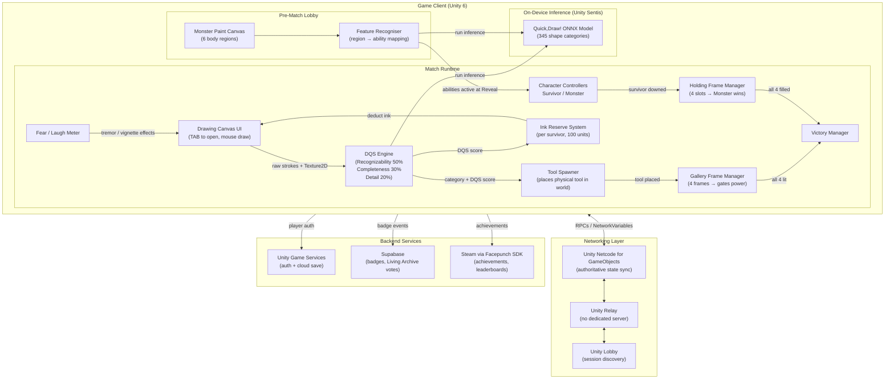
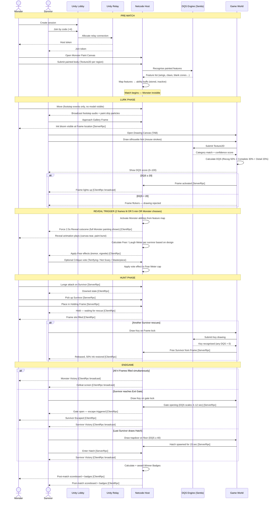

# DREAD SKETCH — Game Design Document
### Drawing-Based Asymmetric Horror

---

## 1. HIGH CONCEPT

**1 Monster vs. 4 Survivors.**

The Monster painted themselves before the match began. Survivors only heard footsteps and dripping paint — until the canvas tears open and their creation climbs out.

Survivors fight back with drawings: a well-drawn key opens a door, a well-drawn torch pushes back darkness, a well-drawn cage buys time. Everything they can use, they must first imagine.

---

## 2. PLAYER COUNTS & ROLES

| Role | Count | Core Loop |
|---|---|---|
| Monster | 1 | Paint yourself. Hide. Reveal. Hunt. |
| Survivor | 4 | Draw tools. Complete frames. Escape. |

Matches last approximately **10–14 minutes.**

---

## 3. THE INK SYSTEM

Ink is the resource that binds both roles.

- Survivors carry a personal **Ink Reserve** (starts at 100 units per match).
- Ink is consumed when drawing a tool. More complex tools cost more.
- Ink Stations (inkwells, paint buckets, dripping walls) are scattered across the map.
  - Filling at a Station takes 4 seconds and restores 60 units.
  - Stations are visible to the Monster — refilling is a risk.
- Ink does not regenerate passively.

---

## 4. THE DRAWING QUALITY SCORE (DQS)

Every drawing receives a score from **0–100** based on three factors:

| Factor | Weight | What it Measures |
|---|---|---|
| Recognizability | 50% | Does the AI recognise what you drew? |
| Completeness | 30% | Is it fully closed/filled? |
| Detail | 20% | Stroke count and coverage |

**DQS directly scales tool effectiveness:**

| DQS Range | Effectiveness | Feel |
|---|---|---|
| 80–100 | 100% — Full effect | Masterwork |
| 50–79 | 70% | Competent |
| 20–49 | 40% | Shaky but functional |
| 1–19 | 15% — Barely works | Scribble |
| 0 | 0% — Dissolves instantly | Unrecognizable |

**Survivors draw in real time** with mouse, stylus, or controller.
- Mouse / stylus: precision mode, no assist.
- Controller: faint guide-line tracing assists available in Settings.
- Drawing while moving is **not allowed** — survivors must stand still or crouch.
  - This is the primary vulnerability window.

---

## 5. SURVIVOR TOOLS — THE DRAWABLE ARSENAL

Each tool requires a drawing and costs Ink. Tools have a **Decay Timer** — they wear out and must be redrawn.

| Tool | Ink Cost | Decay Timer | DQS Effect |
|---|---|---|---|
| **Key** | 15 | One use | DQS scales unlock speed (1–8 seconds) |
| **Torch** | 20 | 90 sec | DQS scales light radius (2m–8m) |
| **Rope** | 25 | One use | DQS scales traverse speed |
| **Bandage** | 10 | One use | DQS scales heal amount (5%–40%) |
| **Mirror** | 30 | 20 sec | DQS scales see-through-wall duration |
| **Cage** | 35 | 45 sec | DQS scales trap hold duration (1–6 sec) |
| **Bridge** | 25 | 60 sec | DQS scales crossing stability |
| **Ladder** | 30 | 60 sec | DQS scales climbable height |
| **Decoy** | 20 | 30 sec | Fake footstep emitter — always works |

**Key rules:**
- Only 2 tools active per survivor at a time. Drawing a third replaces the oldest.
- Failed drawings (DQS 0) waste all the Ink spent — no refund.
- Tools are physical objects placed in the world, not UI buttons.
  A rope you drew dangles from the ledge. A cage you drew sits on the floor.

---

## 6. SURVIVOR OBJECTIVE — THE GALLERY FRAMES

Four **Gallery Frames** are hidden across the map. Each is an empty ornate frame mounted on a wall.

To activate a frame, a survivor must:
1. Stand in front of it (holds a blank canvas).
2. Draw the **silhouette hint** shown inside the frame. The hint changes each match.
   - Examples: a bird, a house, a hand, a clock.
3. When the drawing is accepted (DQS ≥ 20), the canvas "paints itself in" and the frame lights up.

When all 4 frames are filled, **Exit Gates are powered.**

**The catch:** While a survivor draws at a frame, a faint ink bloom appears in the Monster's vision at that location for the entire duration. Hunters and art critics.

---

## 7. ESCAPE

**Exit Gates** — Two standard exit gates on the map.
- Each gate requires a drawn Key to open (slow without one, faster with high DQS).
- Opening takes 12 seconds without a key / 4 seconds with a masterwork key.

**The Hatch** — Spawns when exactly 1 survivor remains.
- The survivor can draw a trapdoor anywhere on any flat floor surface.
- It must be recognizable (DQS ≥ 40). If accepted, the trapdoor opens for 15 seconds.
- The Monster can close it by drawing an X over it (10-second action).

---

## 8. MONSTER RULES

### 8A. THE PRE-MATCH CANVAS PHASE

Before the match loads, the Monster is placed alone in a **Painter's Lobby**: an empty white room.

- **90 seconds** to paint themselves on a full-body canvas.
- 12 paint slots: Head, Torso, Left Arm, Right Arm, Left Leg, Right Leg, Eyes, Mouth, Back, Skin/Texture, Optional Appendage (tail/wings/extra limbs), Special Feature.
- Tools available: brush, smear, fill bucket, eraser, color palette (unlimited colors).
- The painting is **locked in** when the match begins. No changes mid-match.

### 8B. PAINTED FEATURE ABILITIES

Features painted on the Monster body grant passive abilities. The system reads the drawing and maps recognized shapes to buffs:

| Painted Feature (recognized by AI) | Ability Granted |
|---|---|
| Wings on back | +15% movement speed |
| Sharp claws / spikes on hands | Grab reach +1 meter |
| Large eyes | Survivor detection radius +4 meters |
| Armor / scales / plates | Pallet/window stun duration –40% |
| No visible mouth | Silent movement (no footstep audio) |
| Extra limbs | Can grab 2 survivors simultaneously (–10% speed) |
| Teeth / fangs in mouth | Downed survivors take longer to crawl |
| Patterns / fractals on torso | All survivor Ink reserves –15% at Reveal |
| Hair / tentacles obscuring face | Blurs survivor camera when within 6 meters |
| Blank / unpainted area | That area is a **vulnerability zone** (see 8E) |

The Monster can see their recognized features and granted abilities before match start.

### 8C. THE LURK PHASE (Match Start → Reveal)

The Monster begins **invisible.** Only these give them away:
- Footstep sounds (volume based on movement speed — slower = quieter).
- Occasional paint drip particle effects near their feet.
- Scratching sounds if they are within 8 meters of a wall.

The Monster can see survivors normally during the Lurk Phase.
The Monster **cannot attack** during the Lurk Phase — only observe and position.

### 8D. THE REVEAL

Triggered by **whichever comes first:**
- 2 Gallery Frames are completed.
- 5 minutes have elapsed.
- The Monster chooses to reveal early (voluntary — cannot be undone).

**The Reveal sequence:**
1. All ambient audio cuts out for 1.5 seconds.
2. A massive paint-covered canvas tears across the sky of the map (cinematic effect).
3. Every survivor gets a mandatory 2.5-second forced-perspective view of the Monster's full painting.
4. The Monster emerges, fully visible, from a burst of paint in the center of the map.
5. All painted abilities activate simultaneously.

**The Fear Meter:**
After the Reveal, each survivor gains a Fear Meter (0–100) based on the Monster's design:
- Scary features (dark colors, asymmetry, jagged lines, recognized horror shapes) fill the meter faster.
- Fear effects at various thresholds:
  - 30+: Drawing accuracy penalty (hand tremor simulation).
  - 60+: Vision vignette at screen edges.
  - 90+: Occasional audio hallucinations of the Monster nearby.

**The Laugh Mechanic:**
If the Monster's design is overwhelmingly silly (AI detects bright colors, cute shapes, cartoon features), survivors instead experience **Nervous Laughter** — which causes a shaking effect while drawing, and intermittent giggling audio that masks real footstep sounds. Equally dangerous. Differently terrifying.

### 8E. ATTACKING

After the Reveal, the Monster can attack normally.

- **Standard Attack:** Lunge at a survivor. If it connects, the survivor drops their current active tool and enters a Downed state.
- **Vulnerability Zones:** Any area the Monster left **blank** on their painting is a physical weak spot. A survivor who successfully draws a **X** over a weakness (requires standing still, 3 seconds, any DQS) stuns the Monster for 4 seconds.
  - This is high risk / high reward — must be close range.
  - A Monster who painted themselves completely has no vulnerability.

### 8F. THE MONSTER'S OBJECTIVE

The Monster wins by **catching all 4 survivors before the gates power.**

Each time a survivor is Downed and reached by the Monster:
- They are carried to and placed in a **Holding Frame** (a mounted canvas on the wall — a ritual sacrifice mechanic).
- A survivor in a Holding Frame is fully **Caught** and out of the match unless freed.
- Another survivor can free them by drawing a Key on the Frame lock (consumes the Key on use).

**Catching hierarchy:**
- Down a survivor (one hit after a chase).
- Pick them up (2-second animation — the Monster is vulnerable while carrying).
- Place them in the nearest available Holding Frame (Frames are fixed locations on the map).
- Once all 4 Holding Frames are occupied simultaneously, the Monster wins instantly — even if gates are powered.

**If a survivor is freed from a Frame:**
- They return to play immediately with 50% Ink.
- The freed Frame becomes available again for the Monster to fill.
- The Monster must re-catch them from scratch — there are no "strikes" or lives.

**The Monster loses** if any survivor escapes through an Exit Gate or the Hatch before all 4 Frames are filled at once.

---

## 9. THE CRITIQUE SYSTEM

During the 2.5-second Reveal cutscene, each survivor can **optionally tap a button** to rate the Monster's painting.

| Rating | Effect |
|---|---|
| 3+ survivors vote "Not Scary" | Fear Meter starts at 50% max for that match |
| 3+ survivors vote "Terrifying" | Fear Meter fills 20% faster for that match |
| All 4 vote "Masterpiece" | Monster earns the **Renowned** cosmetic badge for that design |

The Monster receives a notification of the vote result after the Reveal.
This is intended to create social friction, laughter, and genuine dread in equal measure.

---

## 10. MAP RULES

Each map has a theme and a special environmental rule:

| Map | Environmental Rule |
|---|---|
| Abandoned Art School | Blackout events plunge the map into darkness every 3 minutes (torches essential) |
| Museum After Midnight | Security glass covers some frames — must be cracked with a drawn Hammer tool |
| Forgotten Orphanage | Children's drawings on the walls give survivors hints about Monster's painted features |
| Underground Painter's Studio | Ink floods periodically, reducing Ink Station capacity |
| Ancient Temple of Ink | Ritual symbols on the walls — drawing them grants a 10-second ward (Monster cannot enter) |
| Burned Animation Studio | Flickering projectors show the Monster's silhouette randomly on walls (fake-outs) |
| Children's Hospital Art Wing | All drawing speeds are 30% slower (shaky hands), healing tools are twice as effective |
| Haunted Manga Workshop | Map is partially in black-and-white — color tools cost double Ink |
| Empty Comic Publisher | Panels on the walls act as short-range teleporters (draw a door to connect two panels) |
| Giant Library of Sketchbooks | Sketchbooks scattered around contain lore drawings and 1-use pre-drawn tools |

---

## 11. BALANCE RULES

### Survivor Side
- Cannot draw while sprinting or being chased.
- Tool placement is visible to the Monster as a faint glow.
- Ink Stations emit a soft hum audible to the Monster within 10 meters.
- Survivors cannot stack the same tool type (no two torches at once per person).

### Monster Side
- During the Lurk Phase, movement speed is –20% (tension-building, not power).
- Cannot destroy survivor drawings directly — only physically block or body-block.
- If the Monster voluntarily reveals early, survivors get +20 seconds on the timer before the Monster can attack (grace period).
- Voluntary early reveal grants the Monster a **Frenzy Bonus**: +10% speed for 60 seconds.

### General
- **Anti-Camp Rule:** If the Monster stands within 8 meters of a Holding Frame for more than 12 seconds, the Frame auto-unlocks.
- **Anti-Tunnel Rule:** A recently-freed survivor has a 30-second mark that makes re-catching them give no Holding Frame progress.
- **Skill Gap:** DQS cannot be artificially inflated by copying reference images — the AI checks against a "reference similarity" flag. Tracing is banned in Ranked. Allowed in Casual.

---

## 12. PROGRESSION & COSMETICS

**For Survivors:**
- Unlock new ink colors, brush styles, and canvas skins for their drawing interface.
- Unlock "Sketch Styles" — the aesthetic of their drawn tools (cartoon, charcoal, watercolor, pixel art).

**For Monsters:**
- Unlock new paint tools (spraypaint, oil brushes, ink stamps, glitter).
- Unlock new canvas textures for their body.
- Unlock alternate Reveal animations.
- **The Gallery:** Every Monster design ever used is permanently stored in a personal Gallery. After 10 matches with the same design, that design becomes **Remembered** and earns a plaque in the Gallery.

**The Living Archive:**
- A global, community-facing gallery displays top-rated Monster designs from the week.
- Players can vote on their favorites.
- The highest-rated design of each season is canonized into the game as a collectible sketchbook page in the lore maps.

---

### WINNER BADGES

Awarded at match end. Badges are displayed on a player's profile card and on the post-match scoreboard. Collected into a permanent Badge Book per player.

**Monster Badges**

| Badge | Condition |
|---|---|
| **The Collector** | Caught all 4 survivors in a single match |
| **No Escape** | Caught the last survivor within 30 seconds of gates powering |
| **Perfect Canvas** | Caught all 4 survivors without a single Frame being unlocked |
| **The Reveal** | All 4 survivors voted "Terrifying" during the Reveal |
| **Laughing Last** | Won with a design all 4 survivors voted "Not Scary" |
| **Masterwork** | Won with a design all 4 survivors voted "Masterpiece" |
| **Silent Hunter** | Caught first survivor without anyone hearing a footstep |
| **Frenzied** | Used voluntary early Reveal and still caught all 4 survivors |
| **The Author** | Used the same Monster design to win 10 matches (Remembered design) |
| **Blank Slate** | Won a match with a completely blank/unpainted Monster |

**Survivor Badges**

| Badge | Condition |
|---|---|
| **The Escapist** | Escaped through a gate or Hatch |
| **Last Breath** | Escaped as the final survivor through the Hatch |
| **The Locksmith** | Freed 3 survivors from Holding Frames in a single match |
| **Ink Master** | Drew 6 tools with DQS 80+ in a single match |
| **The Fearless** | Escaped with a Fear Meter above 90 |
| **Art Critic** | Your Critique vote accurately predicted the match outcome |
| **Gallery Complete** | Activated all 4 Gallery Frames solo |
| **Steady Hand** | Drew a tool with DQS 100 while being actively chased |
| **The Ghost** | Escaped without ever being Downed |
| **Savior** | Freed a survivor from a Frame with less than 10 seconds before all 4 would have been filled |

**Shared / Special Badges**

| Badge | Condition |
|---|---|
| **Worthy Opponents** | Monster wins but all 4 survivors had a DQS 80+ tool at time of loss |
| **Close Call** | Match ends with fewer than 30 seconds remaining on the timer |
| **Season Champion** | Finish in top 100 ranked Monster or Survivor at season end |
| **Canon** | Your Monster design is selected as the season's Living Archive winner |

---

## 13. THE LORE LAYER

Discoverable items scattered across maps:
- Unfinished paintings with the Monster started but never completed.
- Sketchbooks with entries from previous survivors.
- Children's drawings labeled with dates going back centuries.
- Walls papered with hundreds of failed monster shapes — all different, all wrong.
- A canvas in every map that shows **your** last Monster design, half-erased.

**The Core Revelation** (end of lore, discovered across many matches):

The creature has no fixed form. It cannot exist without being imagined. Every time someone paints it, they give it another life. It has lived in the strokes of ten thousand artists — terrifying ones, silly ones, half-finished ones abandoned at 3am.

The Monster does not hate the survivors.

It needs them.

Every match is an act of creation.

Every player who picks up the brush is, technically, the monster's god.

---

## 14. QUICK REFERENCE — MATCH FLOW

```
PRE-MATCH
└── Monster paints (90 sec)         Survivors draw starting tool (30 sec)

LURK PHASE (Monster invisible)
└── Monster observes               Survivors draw tools, find frames, avoid
└── Ink drips, footsteps only      Drawing at frames = ink bloom in Monster vision

REVEAL TRIGGER (2 frames done OR 5 min elapsed OR Monster chooses)
└── Canvas tears open
└── Survivors see full painting (2.5 sec forced view)
└── Fear / Laughter Meters assigned
└── Monster emerges — all abilities active

HUNT PHASE
└── Monster attacks                Survivors complete remaining frames
└── Caught survivor → Holding Frame (3 lives)
└── Freed by drawn Key

ENDGAME
└── 4 frames done → Gates power
└── Survivors draw Keys → Open gates → Escape
└── Last survivor → draw Hatch anywhere

VICTORY
Monster wins: all 4 Holding Frames occupied simultaneously
Survivors win: any survivor escapes through gate or Hatch before all Frames fill
```

---

## 15. SYSTEM ARCHITECTURE — COMPONENT DIAGRAM



---

## 16. MATCH FLOW — SEQUENCE DIAGRAM



---

*"The Canvas Awakens."*
